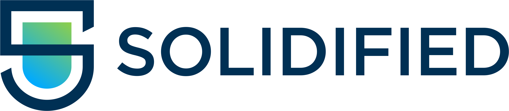

# Solidified - Web3 Security

## Raising the Bar for the Industry

Proper security doesn’t stop at the audit report. We will fix your code, but our mission is to contribute to a better industry. Read our manifesto.

### Work with the Elite 

We bring in the **top contest winners**, researchers, and engineers — people whose names are recognized in the industry.

### Skin in the Game

We sell **time and incentives**.

No matter which firm you engage, what counts is incentivizing the right people in an environment that enables them to focus on the job.  

After more than a decade in cybersecurity working with OGs like the Ethereum Foundation, Arbitrum, and many projects on Solana, we’ve learned one thing:

**Even the best need the right incentives**. Our auditors compete with each other in our blinded process, so it’s very obvious if they don’t match the highest expectations. **If critical issues are missed, a significant portion of our fee is returned**, which would have otherwise gone to the auditor as a performance bonus.

### Tailor made

We tailor every step of our process to your needs. Attackers often target the weakest links - our audits include workshops about security strategy and threat modeling to strengthen your whole security posture.  

[Schedule a discovery call with our leadership team](https://calendar.app.google/izspPU2TbZRBgTZ77).

### Full scope

For teams that want the most, we offer a **Virtual Chief Security Officer (vCISO)**. 

We guide your full security operations: Secure development workflows, incident readiness, DevSecOps coaching, internal reviews — all covered.

[Learn more about our vCISO offering](https://docs.google.com/document/d/1VM3FYB8JATYh79SgwV7uYfCLw_FfZH8kHYZYITun-aA/edit?tab=t.0#heading=h.83mb4w65g9il)

Reference Projects | Request a quote: [info@solidified.io](mailto:info@solidified.io)

## Cybersecurity of a New Area - a Manifesto

Imagine a web3 where **hacks don’t define the headlines**. A place that deserves to be called trustless. 

Where users can trust their protocols as much as their principles.

That future isn’t science fiction — it’s a matter of discipline, culture, and design. Security isn’t the constraint; it’s the enabler of the world we set out to build.

We are industry veterans who deeply **care** for the space. **And we see how one thing doesn’t change: too many exploits in web3**. 

This adds volatility to markets, uncertainty for users, **and prevents mass adoption**. 

We want to change this.

Every week, we open hacker leaderboards and see how millions of dollars are lost.
If we want to raise the bar for the whole industry, it starts with a mindset:

The mental model in this space needs to be one of zero trust: Any layer of your protocol may be compromised. It’s a question of when, not if.

Accountability cannot stop at the auditor. You cannot outsource a security mindset.
You can hire someone to help build it.  Security isn’t a service you buy once and forget.
It’s discipline. A culture. And it must live inside your team just as much as it lives in us.

This also means acknowledging a hard truth: The most significant losses don’t just come from bugs in code, they result from not embedding security from the beginning and at every stage. 

Empirically compromised keys and flawed operational security have been the biggest security incidents. 
To adopt a zero-trust mentality, security must be a priority throughout your whole product development lifecycle. Operational security has to be considered from day zero.

You need redundancy in our systems. You need failsafes. You need strong incentives — because even the best tools are built by humans, and even the best humans can be negligent on their worst day of the year.
We are here to help you with that, as security architects. 

To achieve the highest standards, we need highly customized solutions. This is the time for bespoke, embedded security—a tailored process that fits your team’s development style, your operational pipeline, and your specific threat profile.

---

© 2025 · Solidified is a brand of Oak Security GmbH

[Privacy policy](PRIVACY.md)

[Imprint & legal disclosure](IMPRINT.md)

